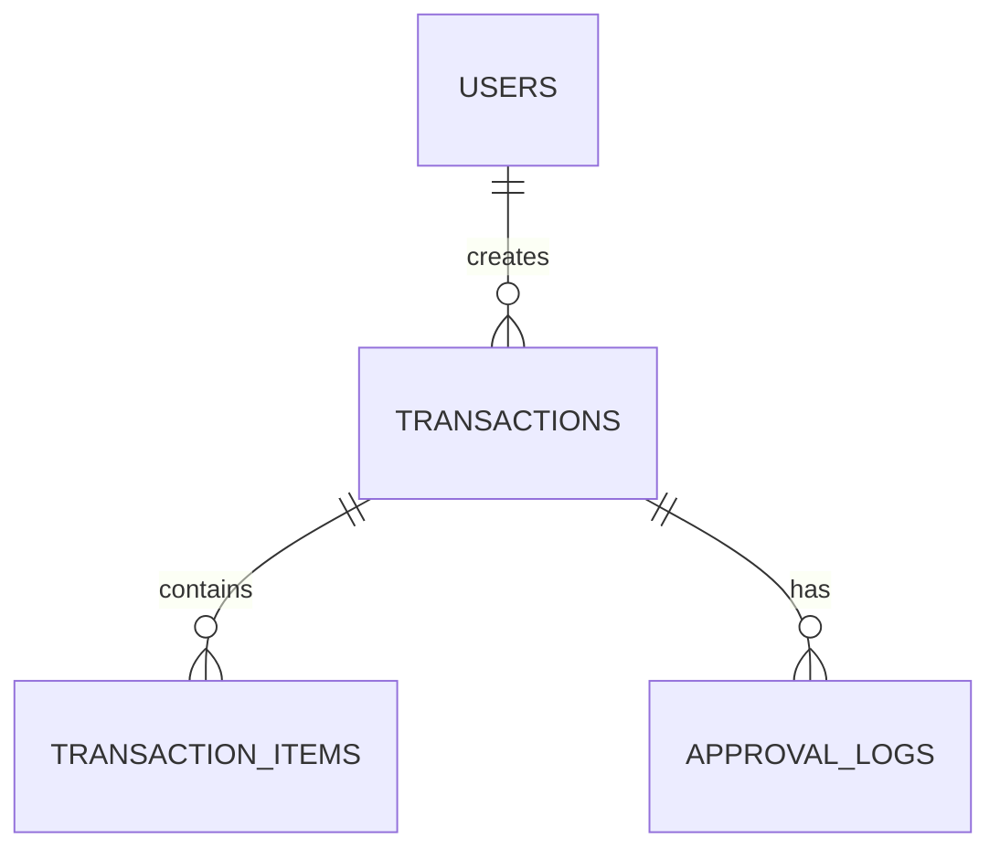

# Database Schema

> Project: `[PROJECT_NAME]`  
> Database: `PostgreSQL`  
> Updated: `[YYYY-MM-DD]`

## 1. Database principles

- PostgreSQL adalah default.
- Migration adalah source of truth perubahan schema.
- Business invariant penting sebaiknya memiliki constraint database jika praktis.
- Jangan menganggap database production kosong.
- Index dibuat berdasarkan query nyata.
- Hindari duplicate source of truth.
- Foreign key digunakan jika integritas relasi memang diperlukan.

## 2. ERD

Ganti contoh berikut dengan ERD project.



## 3. Table catalog

| Table | Purpose | Model | Soft delete |
|---|---|---|---:|
| `users` | application users | `User` | `[YES/NO]` |
| `[table]` | `[purpose]` | `[Model]` | `[YES/NO]` |

## 4. Table definition

### `users`

| Column | PostgreSQL type | Nullable | Default | Constraint/Note |
|---|---|---:|---|---|
| `id` | bigint | No | identity | PK |
| `name` | varchar(150) | No | - | |
| `email` | varchar(255) | No | - | UNIQUE |
| `password` | varchar(255) | No | - | hashed |
| `created_at` | timestamp | Yes | - | |
| `updated_at` | timestamp | Yes | - | |

### `[TABLE_NAME]`

| Column | PostgreSQL type | Nullable | Default | Constraint/Note |
|---|---|---:|---|---|
| `id` | bigint | No | identity | PK |
| `[column]` | `[type]` | `[Yes/No]` | `[default]` | `[constraint]` |
| `created_at` | timestamp | Yes | - | |
| `updated_at` | timestamp | Yes | - | |

## 5. Relationship

| Parent | Child | Type | Foreign key | On delete |
|---|---|---|---|---|
| `users` | `[table]` | 1:N | `[table].user_id` | `[RESTRICT/CASCADE/SET NULL]` |

Jangan memilih cascade delete tanpa mempertimbangkan history/audit.

## 6. Index

| Table | Columns | Type | Query pattern |
|---|---|---|---|
| `[table]` | `[column]` | btree | `[query]` |

Index harus punya alasan yang dapat dijelaskan.

## 7. Constraint

| ID | Table | Constraint | Reason |
|---|---|---|---|
| DBR-001 | `[table]` | `[constraint]` | `[invariant]` |

## 8. Legacy mapping

Bagian ini wajib jika project merupakan rebuild/migrasi sistem lama.

| Legacy table.column | New table.column | Action | Reason |
|---|---|---|---|
| `[old]` | `[new]` | Rename/Keep/Remove/Merge/Split | `[reason]` |

Contoh:

```text
legacy typo column
    -> rename

unused column
    -> remove

2 redundant columns
    -> merge into one normalized field
```

## 9. Migration rules

### Penambahan column wajib pada data existing

```text
1. Add nullable/safe default
2. Deploy compatible application
3. Backfill
4. Validate
5. Enforce NOT NULL/constraint
```

### Rename/drop

Untuk production, pertimbangkan compatibility window jika aplikasi lama masih berjalan.

## 10. Migration example

```php
Schema::create('purchase_requests', function (Blueprint $table) {
    $table->id();
    $table->foreignId('requested_by')
        ->constrained('users')
        ->restrictOnDelete();
    $table->string('status', 30)->default('draft');
    $table->text('notes')->nullable();
    $table->timestamps();

    $table->index(['requested_by', 'status']);
});
```

Sesuaikan dengan schema sebenarnya.

## 11. Data migration

Jika migration membutuhkan transformasi data, dokumentasikan:

- sumber;
- target;
- mapping;
- jumlah row perkiraan;
- strategy backfill;
- validasi;
- rollback/mitigasi.

## 12. Seeders/factories

- Factory untuk test/development.
- Seeder master/reference data harus idempotent jika memungkinkan.
- Jangan memasukkan data production privat.
- Jangan memasukkan secret asli.

## 13. Sensitive data

| Table.Column | Classification | Encryption/Hash | Log | API |
|---|---|---|---|---|
| `users.password` | Secret | hash | No | Never |
| `[column]` | `[class]` | `[rule]` | `[rule]` | `[rule]` |

## 14. Schema checklist

- [ ] Semua table punya tujuan jelas.
- [ ] Relationship sudah ditentukan.
- [ ] Index berdasarkan query nyata.
- [ ] Constraint penting sudah ditentukan.
- [ ] Tidak ada duplicate source of truth tanpa alasan.
- [ ] Legacy mapping sudah ditulis jika migrasi.
- [ ] Migration aman untuk data existing.
